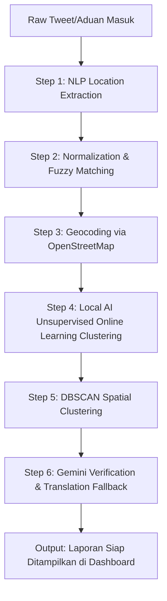

# 🧠 Panduan Teknis: Pipeline Analisis Aduan (Analyzer Service)

Dokumen ini menjelaskan alur pemrosesan data aduan warga secara bertahap (*step-by-step pipeline*) di dalam **`AnalyzerService`** (`src/analyzer/analyzer.service.ts`). 

Pipeline ini berfungsi sebagai "otak utama" yang menerima teks laporan mentah, melakukan pemrosesan bahasa (NLP), melakukan pemetaan geospasial, mengelompokkan data secara mandiri (Local AI Unsupervised Online Learning), dan diverifikasi oleh kecerdasan buatan (Gemini AI).

---

## 📐 1. Diagram Alur Pipeline (Data Pipeline Flow)

Setiap kali ada laporan baru masuk (misalnya dari media sosial Twitter/X), data tersebut akan dialirkan melalui **6 tahapan pemrosesan** berikut:

---

## 🔍 2. Penjelasan Detail Setiap Langkah (Step-by-Step Breakdown)

Berikut adalah penjelasan fungsi setiap langkah, alasan teknis mengapa langkah tersebut diperlukan, serta teknologi pendukungnya:

### 📍 Step 1: Ekstraksi Lokasi Semantik (NLP Location Extraction)
*   **Apa yang Terjadi**: Sistem memindai kalimat laporan warga menggunakan library **Compromise NLP** untuk mendeteksi kata benda penunjuk tempat/lokasi.
*   **Kenapa Dibutuhkan**: Laporan dari warga sering kali berantakan. Contoh: *"Min ada banjir nih di Sudirman deket halte"*. Sistem harus secara cerdas memisahkan kata kunci lokasi (`Sudirman`) dari kata-kata umum lainnya tanpa bantuan manusia.

---

### 📍 Step 2: Normalisasi dan Fuzzy Matching (Pembersihan Teks)
*   **Apa yang Terjadi**: Kata lokasi hasil Step 1 dibersihkan (dihapus karakter anehnya) lalu dicocokkan menggunakan algoritma **Fuzzy String Matching** ke kamus kota/kecamatan.
*   **Kenapa Dibutuhkan**: Manusia sangat sering melakukan kesalahan ketik (typo). Contoh: *"sudirmn"* atau *"sudrmn"*. Algoritma Fuzzy Match memastikan sistem tetap memahami bahwa lokasi yang dimaksud adalah *"Sudirman"* dengan menghitung jarak kemiripan string (*Levenshtein Distance*).

---

### 📍 Step 3: Geocoding Koordinat Nyata (OpenStreetMap)
*   **Apa yang Terjadi**: Sistem mengirimkan kueri lokasi yang sudah bersih ke API **OpenStreetMap (OSM)** untuk meminta titik koordinat nyata geografisnya (`Latitude` dan `Longitude`).
*   **Kenapa Dibutuhkan**: Untuk menampilkan pin aduan di peta interaktif Frontend (seperti OpenStreetMap/Leaflet), sistem membutuhkan koordinat angka desimal presisi, bukan sekadar teks alamat.

---

### 📍 Step 4: Local AI Unsupervised Online Learning Clustering (100% Bebas Token & Offline-Friendly!)
*   **Apa yang Terjadi**: Teks laporan warga diubah menjadi peta frekuensi kata (*Word Frequency Map*), lalu dicocokkan menggunakan **Sparse Cosine Similarity** terhadap *Centroid* kategori yang sudah ada di database. 
    *   Jika kemiripan berada di atas threshold ($\ge 0.20$), laporan dikelompokkan ke kategori tersebut dan **Centroid-nya diperbarui secara adaptif** menggunakan *Vector Quantization Online Update Rule* agar sistem terus belajar secara mandiri.
    *   Jika kemiripan di bawah threshold ($< 0.20$), laporan diidentifikasi sebagai jenis masalah baru. Sistem **secara otomatis melahirkan kategori baru** di database dan memberi nama kategori tersebut secara otomatis tanpa campur tangan manusia.
*   **Kenapa Dibutuhkan**: Menghilangkan ketergantungan pada Gemini API yang mahal untuk clustering dasar sehingga **hemat 100% token Gemini**. Algoritma ini berjalan sepenuhnya lokal di memori server dan memastikan database kategori Anda terus bertumbuh secara organik mengikuti aduan warga.

---

### 📍 Step 5: DBSCAN Spatial Clustering (Deteksi Titik Krisis Aktif)
*   **Apa yang Terjadi**: Sistem mengambil seluruh titik koordinat di database dan menjalankan algoritma **DBSCAN (Density-Based Spatial Clustering)** dengan radius epsilon tertentu (misal: 10 km).
*   **Kenapa Dibutuhkan**: Jika dalam radius 10 km terdapat banyak laporan aduan yang menumpuk di waktu yang sama, DBSCAN akan mendeteksinya sebagai **1 Cluster/Active Node (Titik Krisis Aktif)**. Ini sangat berguna bagi pembuat kebijakan (Pemerintah/BPBD) untuk langsung mengetahui wilayah mana yang sedang mengalami bencana terparah secara spasial.

---

### 📍 Step 6: Verifikasi Spasial & Translasi Formal (Google Gemini AI & Fallbacks)
*   **Apa yang Terjadi**: Jika Gemini diaktifkan, sistem melemparkan koordinat ke **Gemini AI** untuk memverifikasi apakah koordinat dari OpenStreetMap tersebut valid dan logis sesuai konteks. Gemini juga menerjemahkan teks aduan mentah bahasa Indonesia menjadi bahasa Inggris formal untuk kebutuhan judul & deskripsi laporan resmi.
    *   **Bila Gemini Mati (Bebas Token)**: Sistem secara anggun melakukan degradasi otomatis menggunakan **Penerjemah Lokal / Free Translation Service** dan algoritma lokal untuk menghasilkan parafrase deskripsi formal.
*   **Kenapa Dibutuhkan**:
    1.  *Verifikasi*: Mencegah aduan palsu (*spam*) dengan mencocokkan data geospasial secara cerdas.
    2.  *Translasi*: Laporan dari media sosial biasanya menggunakan bahasa gaul/slang. Gemini AI atau penerjemah offline mengubahnya menjadi bahasa formal yang terstruktur agar laporan terlihat rapi dan profesional di dashboard utama.

---

## 🎓 3. Poin Presentasi Akademis (Untuk Sidang Anda)

Saat mempresentasikan modul **Analyzer** ini, tonjolkan keunggulan sistem Anda dengan argumen berikut:

1.  **Arsitektur Unsupervised & Self-Learning**: Sistem Anda tidak memerlukan proses pre-training manual dengan ribuan dataset berlabel. Dengan algoritma **Leader-Follower Clustering**, database kategori berkembang, lahir, dan belajar secara dinamis secara lokal langsung dari laporan warga.
2.  **Keamanan Token & Skalabilitas Tinggi**: Clustering berbasis **Sparse Cosine Similarity** menghemat pemakaian API eksternal secara drastis (100% bebas token untuk pengelompokan), sehingga aman dari risiko kehabisan saldo token Gemini dan kebal terhadap rate-limiting API.
