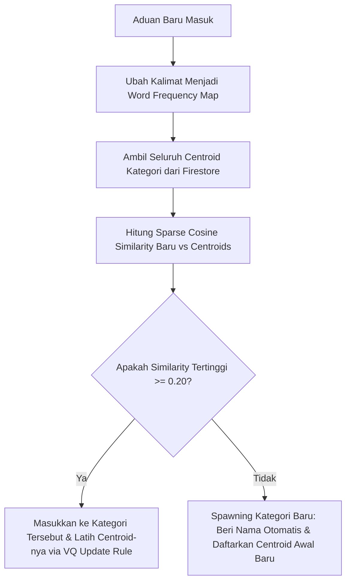

# 📊 Panduan Teknis: Algoritma Leader-Follower Online Clustering & Online Learning

Dokumen ini menjelaskan secara mendalam bagaimana **Algoritma Leader-Follower Online Clustering** digabungkan dengan **Vector Quantization (VQ) Online Learning Update Rule** di backend untuk mengelompokkan laporan/tweet aduan secara dinamis, melahirkan kategori baru secara otomatis, dan belajar secara bertahap tanpa menggunakan dataset berlabel di awal (*Unsupervised Online Machine Learning*).

Sistem ini berjalan sepenuhnya lokal di backend NestJS tanpa menggunakan token Gemini API untuk proses klasifikasi dasar!

---

## 🗂️ 1. Pendahuluan: Mengapa Menggantikan K-Means Tradisional?

Algoritma pengelompokan tradisional seperti **K-Means** memiliki dua kelemahan fatal untuk sistem pemantauan aduan real-time:
1.  **Jumlah Kelompok ($K$) Harus Ditentukan dari Awal**: K-Means memaksa kita menetapkan jumlah klaster sejak awal (misal: harus tepat $K = 3$). Jika ada jenis laporan baru di luar 3 kelompok itu, K-Means akan memaksanya masuk ke salah satu dari 3 kelompok tersebut, menghasilkan klasifikasi yang salah.
2.  **Statik & Tidak Bisa Belajar Secara Instan**: K-Means tidak dirancang untuk menerima satu data baru secara dinamis dan melakukan pembelajaran inkremental secara real-time (*online learning*).

Untuk mengatasi hal tersebut, kita mengimplementasikan **Leader-Follower Clustering dengan Sparse Cosine Similarity & Vector Quantization (VQ) Update Rule** (Aturan Pembaruan Saraf Kohonen / Self-Organizing Maps).

---

## 📐 2. Alur Kerja Sistem (Step-by-Step Workflow)

Proses klasifikasi dan pembaruan klaster berjalan secara instan melalui tahapan berikut:



### 📍 Langkah 1: Ekstraksi Kosakata (Sparse Word Frequency Map)
Saat aduan baru masuk dan diterjemahkan, sistem mengubah kalimat tersebut menjadi **Peta Frekuensi Kata** (*Bag-of-Words*).
*   *Kalimat*: `"Sir there are roadstead with potholes in Sudirman"`
*   *Vektor Representasi*:
    ```json
    { "roadstead": 1, "potholes": 1, "sudirman": 1 }
    ```
    *(Kata-kata tidak penting/stop words dibuang secara otomatis)*

---

### 📍 Langkah 2: Perhitungan Kemiripan Semantik (Sparse Cosine Similarity)
Sistem membandingkan peta kata tweet tersebut dengan **Centroid** (peta frekuensi kata rata-rata) milik setiap kategori di Firestore menggunakan **Cosine Similarity**:

$$\text{Similarity}(A, B) = \frac{\sum (A_i \times B_i)}{\sqrt{\sum A_i^2} \times \sqrt{\sum B_i^2}}$$

*   **Keunggulan "Sparse"**: Rumus ini hanya mengiterasi kata-kata yang aktif. Jika kata tidak cocok, ia langsung diabaikan. Ini membuat perhitungan sangat efisien (berjalan kurang dari `0.001` detik).

---

### 📍 Langkah 3: Pengambilan Keputusan (Leader-Follower Threshold Check)
Sistem mencari kategori dengan nilai kemiripan tertinggi terhadap tweet baru tersebut:
*   Jika kemiripan tertinggi $\ge 0.20$ (ambang batas kemiripan konteks 20%): Tweet tersebut dikelompokkan ke kategori tersebut (**Follower bergabung ke Leader terdekat**).
*   Jika kemiripan tertinggi $< 0.20$: Tweet tersebut dianggap sebagai jenis laporan masalah baru yang unik (**Follower melahirkan Leader baru**).

---

### 📍 Langkah 4: Pembaruan Bobot Adaptif (Online Learning Update Rule)
Jika aduan masuk ke kategori yang sudah ada, sistem tidak mendiamkannya. Vektor Centroid kategori tersebut di database akan diperbarui agar sistem **semakin pintar** dan mengenali variasi bahasa baru warga.

Kita menggunakan **Vector Quantization (VQ) Update Rule** (seperti pada Jaringan Saraf Tiruan Kohonen / Self-Organizing Maps):

$$\vec{C}_{baru} = (1 - \eta)\vec{C}_{lama} + \eta\vec{X}$$

Dimana:
*   $\vec{C}$ = Vektor Centroid Kategori di Firestore.
*   $\vec{X}$ = Vektor aduan baru.
*   $\eta$ (Learning Rate) = Set sebesar **`0.20` (20%)**. Kosakata baru dari tweet diserap perlahan sebesar 20%, sedangkan pola kata lama tetap dipertahankan sebesar 80%.

Sistem juga melakukan **Pruning (Pemangkasan)** kata-kata yang memiliki bobot $< 0.05$ agar dokumen Firestore tetap ringan dan terbebas dari kosakata sampah.

---

### 📍 Langkah 5: Pelahiran Kategori Baru Secara Mandiri
Jika kemiripan $< 0.20$, sistem akan:
1.  Mengambil kata benda benda (*nouns*) paling dominan dari laporan mentah bahasa Indonesia (misal: `"kebocoran & pipa"`).
2.  Menerjemahkannya secara luring gratis ke bahasa Inggris $\rightarrow$ `"Leakage & Pipe"`.
3.  Memformatnya menjadi ID baru di database $\rightarrow$ `LEAKAGE_PIPE`.
4.  Mendaftarkan kategori baru tersebut ke Firestore dengan `centroid` awal berisi peta kata dari aduan tersebut.

---

## 🎓 3. Poin Akademis untuk Sidang Ujian / Tugas Akhir

Jika dosen penguji menanyakan aspek kecerdasan buatan dari sistem pengelompokan dinamis Anda, jelaskan dengan 4 keunggulan akademis ini:

1.  **Dynamic Database Expansion (Zero-Shot & Unsupervised)**: Sistem tidak terbatas pada 3 atau 4 kategori kaku. Database kategori tumbuh dan menyesuaikan diri secara mandiri seiring aduan riil masyarakat yang masuk.
2.  **Penerapan Kohonen Update Rule (SOM)**: Menggunakan prinsip *Competitive Learning* dan *Kohonen Neural Weight Adaptation* secara luring pada representasi data teks untuk menghindari *Catastrophic Forgetting* (lupa ingatan mendadak pada model saraf).
3.  **Efisiensi Sumber Daya & Kebal Rate Limit**: Algoritma ini berjalan sepenuhnya lokal di memori backend NestJS, berjalan dalam **mikrodetik**, serta **mengonsumsi 0 token Gemini API**, menjamin sistem tahan banting saat terjadi lonjakan laporan warga.
4.  **Sparse Cosine Complexity**: Vektorisasi jarang (*sparse vector computation*) menjamin pencarian klaster berskala besar tetap efisien karena kompleksitas komputasinya hanya bergantung pada panjang kata di tweet, bukan pada ukuran seluruh kamus kata di database ($O(W)$ vs $O(V)$).
